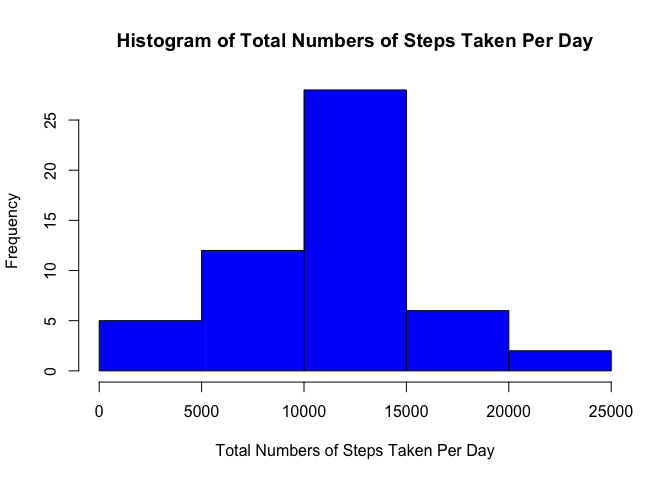
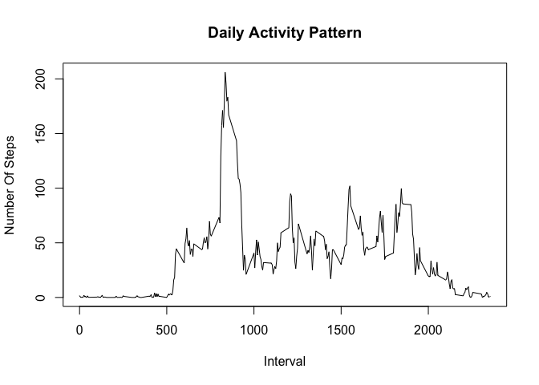
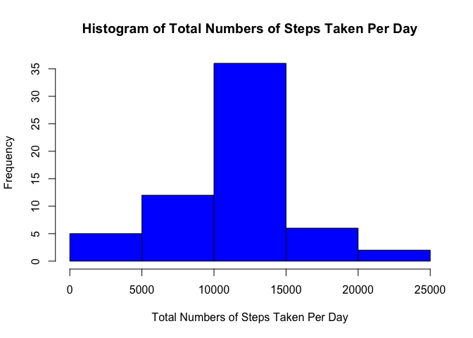
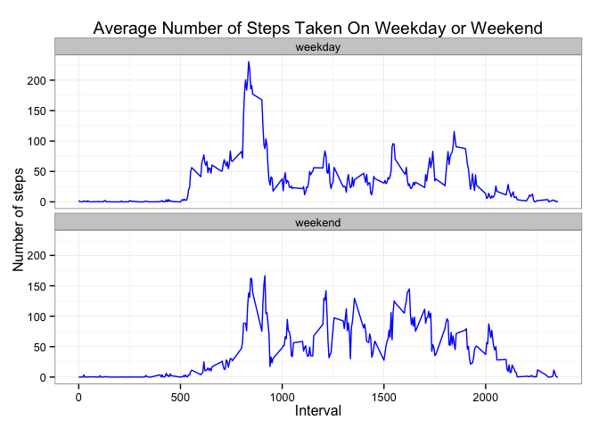

# Reproducible Research: Peer Assessment 1

## Loading and preprocessing the data
Load and process the data.


```r
activityData<-read.table("activity.csv",sep=",", header=TRUE);
activityData$date<-as.Date(activityData$date);
```

## What is mean total number of steps taken per day?

Ingore the missing values in the dataset and calculate the total number of steps taken per day.


```r
rmActivity<-na.omit(activityData);
perDay<-aggregate(rmActivity[,1],list(rmActivity$date),sum);
hist(perDay$x,main="Histogram of Total Numbers of Steps Taken Per Day",xlab="Total Numbers of Steps Taken Per Day",col="blue");
```

 

Calucatate the mean and median of the total number of steps taken per day.


```r
mean(perDay$x);
```

```
## [1] 10766.19
```

```r
median(perDay$x);
```

```
## [1] 10765
```

## What is the average daily activity pattern?


```r
perInterval<-aggregate(rmActivity[,1],list(rmActivity$interval),mean);
plot(x=perInterval$Group.1,y=perInterval$x,type="l",xlab="Interval",main="Daily Activity Pattern",ylab="Number Of Steps");
```

 

Calculate which 5-minute interval, on average across all the days in the dataset, contains the maximum number of steps


```r
perInterval[perInterval$x==max(perInterval$x),]$Group.1;
```

```
## [1] 835
```

## Imputing missing values

Calculate the total number of missing values in the dataset.


```r
nrow(activityData) - nrow(rmActivity);
```

```
## [1] 2304
```

Create a new dataset with the missing data filled in by using the mean for the 5-minutes interval to replace missing values in the dataset. 


```r
activityMiss<-activityData[!complete.cases(activityData),]
for (i in 1:nrow(activityMiss)) {
  activityMiss[i,]$steps<-perInterval[perInterval$Group.1==activityMiss[i,]$interval,]$x;
}
fixActivity<-rbind(rmActivity,activityMiss);
```

Calculate the total number of steps taken per day using the modified dataset.


```r
perDayFix<-aggregate(fixActivity[,1],list(fixActivity$date),sum);
hist(perDayFix$x,main="Histogram of Total Numbers of Steps Taken Per Day",xlab="Total Numbers of Steps Taken Per Day",col="blue");
```

 

Calucatate the mean and median of the total number of steps taken per day using the modified dataset.


```r
mean(perDayFix$x);
```

```
## [1] 10766.19
```

```r
median(perDayFix$x);
```

```
## [1] 10766.19
```

The mean of the modified dataset is the same as that of the dataset with missing values removed.  The median of the modified dataset is slightly higher than that of the dataset with missing values remvoed. 

## Are there differences in activity patterns between weekdays and weekends?

Create a new factor variable in the dataset with two levels – “weekday” and “weekend” indicating whether a given date is a weekday or weekend day.


```r
weekf<-factor(c("weekday","weekend"));
weekendDays<-c("Saturday","Sunday");
fixActivity$weekdayI<-rep(weekf[1],nrow(fixActivity));
for (i in 1:nrow(fixActivity)) {  
  if (weekdays(fixActivity[i,]$date) %in% weekendDays) fixActivity[i,]$weekdayI<-weekf[2];
}
weekActivity<-subset(fixActivity,weekdayI==weekf[1]);
perIntervalWeekday<-aggregate(weekActivity[,1],list(weekActivity$interval),mean);
perIntervalWeekday$weekdayI<-rep(weekf[1],nrow(perIntervalWeekday));
weekendActivity<-subset(fixActivity,weekdayI==weekf[2]);
perIntervalWeekend<-aggregate(weekendActivity[,1],list(weekendActivity$interval),mean);
perIntervalWeekend$weekdayI<-rep(weekf[2],nrow(perIntervalWeekend));
perIntervalTotal<-rbind(perIntervalWeekday,perIntervalWeekend);
library(ggplot2);
ggplot(perIntervalTotal, aes(x=Group.1, y=x)) + geom_line(color="blue") + facet_wrap(~ weekdayI, nrow=2, ncol=1) + labs(x="Interval", y="Number of steps", title="Average Number of Steps Taken On Weekday or Weekend") + theme_bw();
```

 


